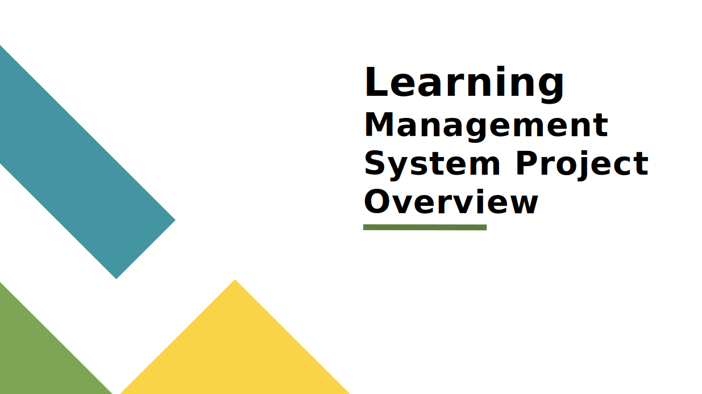

# EDEPedia - DEPI Academy - eLearning Management System

EDEPedia or DEPI Academy is a comprehensive eLearning Management System (eLMS) that provides a platform for students to access courses, interact with instructors, and manage their learning journey. The system consists of three main components: the main app for students, a dashboard app for instructors, and an admin app for system management.

## Project Structure

The project is organized into three main applications:

1. Main App (`src/apps/mainApp`)
2. Dashboard App (`src/apps/dashboardApp`)
3. Admin App (`src/apps/adminApp`)

Each app has its own routing and components, with shared components, utilities, and data in the root `src` directory.

## Project Overall Features

- User authentication and authorization
- Course creation, management, and enrollment
- Video lesson playback and content management
- Progress tracking and analytics
- Instructor profiles and course management
- Student reviews and ratings
- Shopping cart and checkout process
- Responsive design for various devices
- Admin panel for user and content management
- Real-time messaging and notifications
- Comments system and replies
- Rating and reviews system with CRUD operations

## 01 Main App

The main app is the primary interface for students and visitors. It includes the following key features and components:

### Home Page

- Showcases featured courses and instructors
- Provides quick access to course categories
- Displays team members and their mentor (About)

### Course Listing

- Allows users to browse and search for courses
- Implements pagination, filtering, and sorting options
- Displays course cards with key information

### Course Details Page

- Shows comprehensive course information
- Includes instructor details and reviews
- Provides options to enroll or add to cart

### Shopping Cart

- Manages selected courses
- Allows users to adjust quantities, wishes, or remove items

### Wishlist

- Enables users to save courses for later consideration

### Checkout Process

- All courses are free till now!

### User Profile

- Displays enrolled, archived courses, and progress
- Manages account settings and preferences
- Shows reviews, assigned instructors, and the ability to message each one

### Instructor Profiles

- Highlights instructor qualifications and courses
- Displays ratings and student feedback

### Messaging System

- Allows students to communicate with instructors
- Supports real-time notifications for new messages
- Opens a messaging room with the instructor when a course is purchased, with an activity indicator for real-time messaging notifications for new messages, indicating whether they have been read or not.

### Course Content

- Provides access to bought courses
- Implements a progress tracking system for each course
- Latest opened menu of the latest video tracked for better user experience

## 02 Dashboard App

The dashboard app is designed for instructors to manage their courses and interact with students. Key features include:

### Instructor Dashboard

- Displays an overview of course performance and earnings
- Shows recent courses, reviews, and student engagement metrics

### Course Management

- Allows creation and editing of courses
- Integrated with YouTube API to extract videos (titles, sources, and thumbnails) from a playlist

### Review Management

- Displays student reviews for instructor's courses

### Profile Management

- Allows instructors to update their profile information
- Manages instructor qualifications and expertise areas using markdown

## 03 Admin App

The admin app provides system-wide management capabilities:

### User Management

- Manages all user accounts (students, instructors, admins)
- Ability to create, edit, or deactivate user accounts

### Course Oversight

- Reviews and approves new courses
- Monitors course quality and student feedback

## Technologies Used

### Main Technologies

- React.js
- Redux Toolkit for state management
- React Router for navigation
- Bootstrap for styling
- Socket.io for real-time communication
- Chart.js for data visualization
- Axios for API requests

### More Technologies (React Libraries)

- React Hook Form for form handling
- React Select for advanced select inputs
- React Player for video playback
- React Markdown for rendering markdown content
- React Toastify for notifications
- Skeleton for skeleton components on initialization and loading

### Additional Tools

- **Git & GitHub**: For version control, including merging and rebasing.
- **Figma**: For transforming UI designs into functional, interactive, pixel-perfect digital experiences.
- **Vercel**: For hosting the application.

## Material

- [Project PowerPoint](./src/data/preview/EDEPedia-Overview.pptx)
  

## Other Important Sources

- [API Repository Link](https://github.com/ragab0/learning-management-system-api) the back-end repo

- [Figma designes](<https://www.figma.com/design/YaJ5R8AI8PZMNTPNxSu8i7/Learning-Management-System-(Community)>) the Ui designes

  
